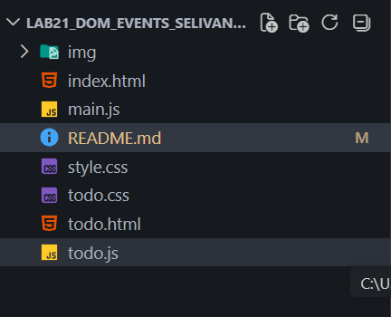

# Лабораторная работа №21 — TODO-лист

## Основная информация

**ФИО:** Селиванов Павел, Беляев Владимир  
**Группа:** ИСП-233  
**Дата:** 29.03.2026

## Краткое описание работы

В ходе лабораторной работы было создано простое приложение TODO‑лист.  
Были изучены и применены следующие возможности JavaScript:

- работа с DOM;
- создание и добавление элементов на страницу;
- обработка событий;
- работа с формами;
- динамическое обновление интерфейса;
- изменение классов и стилей через JS.

## Структура проекта

